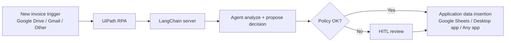

# seia

Smart Expense & Invoice Auditor agentic pipeline bridging unstructured document ingestion and structured enterprise accounting. Uses RAG-powered auditing to verify invoices against company policy.

## Features
- **UiPath RPA Integration**: Automated workflows for document retrieval and downstream ERP entry.
- **Unstructured Ingestion**: Process PDF invoices using `PyPDFLoader`.
- **Structured Extraction**: AI-driven data extraction via LangChain + Ollama.
- **RAG-based Auditing**: Semantic search (Qdrant) to retrieve relevant company policies for expense validation.
- **Human-in-the-Loop**: Manual review step when policy violations are detected.
- **Observability**: Langfuse tracing via LangChain callbacks.
- **Async Processing**: Background task execution with status polling.
- **Healthcheck**: Lightweight `/healthcheck` endpoint.

## Tech Stack
- **Framework**: [LangGraph](https://github.com/langchain-ai/langgraph)
- **LLM Engine**: [Ollama](https://ollama.com/) (model: `lfm2.5-thinking`)
- **Tracing**: [Langfuse](https://langfuse.com/)
- **Vector DB**: [Qdrant](https://qdrant.tech/)
- **API**: FastAPI
- **Embeddings**: `sentence-transformers` (`all-MiniLM-L6-v2`)

## Architecture
The agent follows a cyclic graph:
1. `extract`: Converts raw text to structured JSON.
2. `audit`: Retrieves policies and flags violations.
3. `human_review`: (Conditional) Manual approval if audit fails.
4. `output`: Final state export.

Execution uses LangGraph with an in-memory checkpointer and a conditional route from `audit` to `output` or `human_review` based on status.

RPA intake and routing flow:


## Setup

### Prerequisites
- Python 3.14+
- Ollama
- Qdrant instance

### Installation
1. Install dependencies:
   ```bash
   uv sync
   ```
2. Configure `.env`:
   ```env
   QDRANT_URL=your_qdrant_url
   QDRANT_API_KEY=your_api_key
   LANGFUSE_PUBLIC_KEY=your_public_key
   LANGFUSE_SECRET_KEY=your_secret_key
   LANGFUSE_HOST=https://cloud.langfuse.com
   ```

`QDRANT_API_KEY` is required for `app/seed.py`. It is optional at runtime if your Qdrant instance is not secured.

Configure Langfuse environment variables if tracing is enabled for your deployment.

## Usage
1. Seed the policy database:
   ```bash
   python -m app.seed
   ```
2. Start the server:
   ```bash
   fastapi dev app/main.py
   ```
3. Process an invoice:
   ```bash
   curl -X POST -F "file=@invoice.pdf" http://localhost:8000/process-invoice
   ```
4. Poll status:
   ```bash
   curl http://localhost:8000/status/<task_id>
   ```
5. Healthcheck:
   ```bash
   curl http://localhost:8000/healthcheck
   ```
